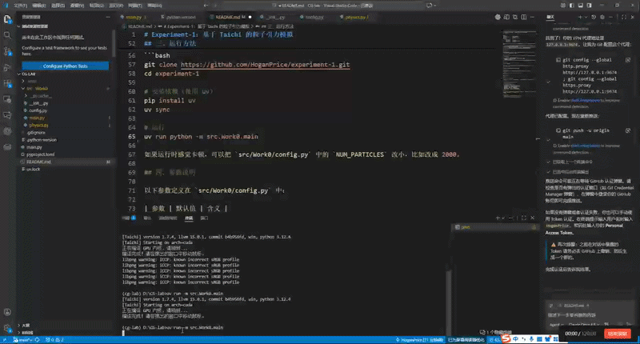

# Experiment-1：基于 Taichi 的粒子引力模拟

本项目是计算机图形学课程实验一的实现，使用 Taichi 框架完成了一个简单的 GPU 粒子引力模拟程序。程序运行后会弹出窗口，窗口中有大量粒子受鼠标位置吸引而运动，同时在边界处发生反弹。

## 一、项目结构

```
CG-lab/
├── main.py                # 根目录入口（预留）
├── pyproject.toml         # 项目配置与依赖声明
├── uv.lock                # 依赖版本锁定
└── src/
    └── Work0/             # 实验 0
        ├── __init__.py
        ├── config.py      # 参数配置
        ├── physics.py     # 物理计算（GPU kernel）
        └── main.py        # 主程序入口
```

项目采用 `src` 布局，各实验代码放在 `src/` 下按编号组织。`Work0` 为本次实验的包，内部按职责拆分为三个模块：

- **config.py**：集中存放可调参数，包括粒子数量、引力强度、阻力系数、反弹系数、窗口分辨率和粒子颜色等。修改此文件即可调整模拟效果，不需要动其他代码。
- **physics.py**：定义粒子的位置和速度两个向量场（`pos`、`vel`），以及两个 Taichi kernel 函数——`init_particles` 负责随机初始化粒子坐标，`update_particles` 负责每帧的物理更新。
- **main.py**：程序入口，负责初始化 Taichi GPU 后端、创建 GUI 窗口、驱动主循环。

## 二、实现思路

### 2.1 初始化

程序启动时，先调用 `ti.init(arch=ti.gpu)` 初始化 GPU 后端，然后通过 `init_particles()` 在显存中为 10000 个粒子分配随机位置，速度初始为零。

### 2.2 每帧物理更新

每一帧中，`update_particles(mouse_x, mouse_y)` 作为 GPU kernel 被调用，所有粒子的计算在 GPU 上并行执行，具体步骤为：

1. 计算当前粒子到鼠标位置的方向向量和距离；
2. 若距离大于阈值 0.05，则沿方向向量施加一个固定大小的引力加速度；
3. 对速度乘以阻力系数（0.98）进行衰减；
4. 根据速度更新粒子位置；
5. 检测是否越过窗口边界（[0, 1] 范围），若越界则将位置钳回边界并将对应分量的速度乘以反弹系数（-0.8）取反。

### 2.3 渲染循环

主循环的流程比较直接：

```
读取鼠标坐标 → 调用 GPU kernel 更新物理 → 将 pos 数据从显存拷回 CPU → 调用 gui.circles 绘制 → gui.show 显示当前帧
```

Taichi 的 GUI 模块会自动处理帧率控制和窗口事件。

## 三、运行方法

环境要求：Python >= 3.12，需要有支持 CUDA 或 Vulkan 的 GPU（集成显卡一般也能跑）。

```bash
git clone https://github.com/HoganPrice/experiment-1.git
cd experiment-1

# 安装依赖（使用 uv）
pip install uv
uv sync

# 运行
uv run python -m src.Work0.main
```

如果运行时感觉卡顿，可以把 `src/Work0/config.py` 中的 `NUM_PARTICLES` 改小，比如改成 2000。

## 四、参数说明

以下参数定义在 `src/Work0/config.py` 中：

| 参数 | 默认值 | 含义 |
|------|--------|------|
| `NUM_PARTICLES` | 10000 | 粒子总数 |
| `GRAVITY_STRENGTH` | 0.001 | 鼠标对粒子的引力大小 |
| `DRAG_COEF` | 0.98 | 速度衰减系数，模拟阻力 |
| `BOUNCE_COEF` | -0.8 | 碰到边界后速度的反弹倍率 |
| `WINDOW_RES` | (800, 600) | 窗口分辨率 |
| `PARTICLE_RADIUS` | 1.5 | 粒子绘制半径（像素） |
| `PARTICLE_COLOR` | 0x00BFFF | 粒子颜色（天蓝色） |

## 五、效果展示

运行程序后，移动鼠标可以看到粒子向鼠标位置聚集，松开或快速移动鼠标时粒子会因为惯性散开，碰到边界后弹回。整体表现为一团粒子跟随鼠标运动并在窗口内振荡。



## 六、调整参数后的效果

为了观察不同参数对系统行为的影响，本实验在 `src/Work0/config.py` 中进行了对比调参，记录如下：

1. **降低粒子数量（`NUM_PARTICLES: 10000 → 2000`）**  
    渲染压力明显下降，帧率更稳定；粒子团视觉密度降低，轨迹层次感会变弱。

2. **提高引力强度（`GRAVITY_STRENGTH: 0.001 → 0.003`）**  
    粒子向鼠标收拢速度加快，聚团更紧；快速移动鼠标时会出现更明显的“拖拽跟随”效果。

3. **增大阻力（`DRAG_COEF: 0.98 → 0.95`）**  
    速度衰减更快，粒子更容易停在目标区域附近；整体运动更平稳，但动态感略有降低。

4. **调整反弹系数（`BOUNCE_COEF: -0.8 → -0.6`）**  
    边界碰撞后的回弹幅度减小，粒子在边界附近的振荡次数减少，画面更“收敛”。

综合来看，若目标是演示“流畅+稳定”的交互效果，推荐参数组合为：

- `NUM_PARTICLES = 2000`
- `GRAVITY_STRENGTH = 0.002 ~ 0.003`
- `DRAG_COEF = 0.95 ~ 0.97`
- `BOUNCE_COEF = -0.6 ~ -0.75`

## 七、依赖

- [Taichi](https://github.com/taichi-dev/taichi) >= 1.7.4
- Python >= 3.12
- 包管理工具：[uv](https://github.com/astral-sh/uv)